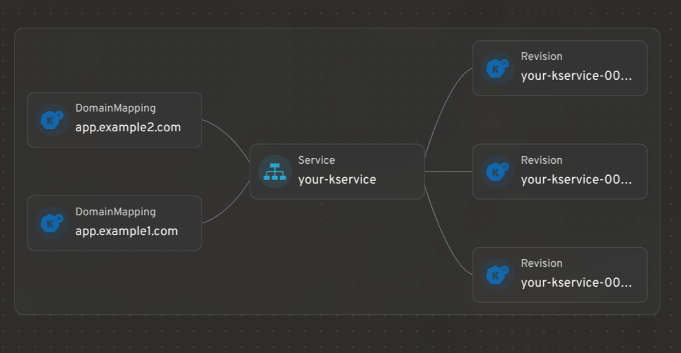
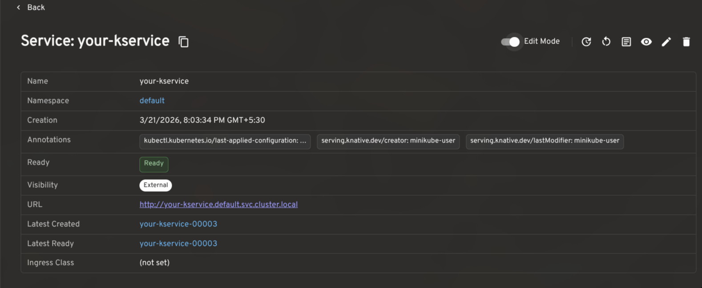
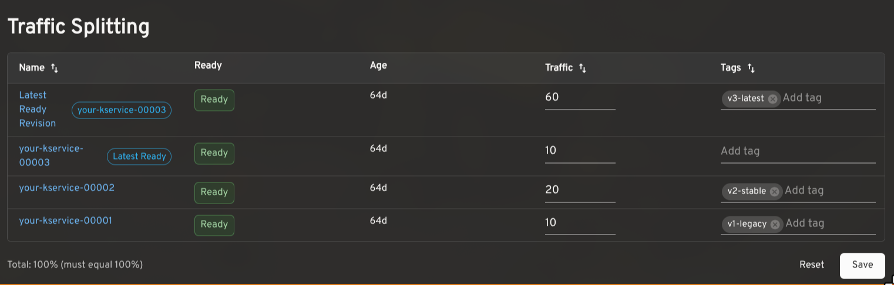
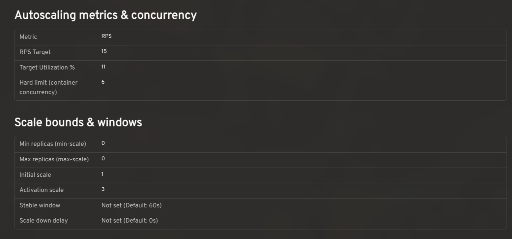
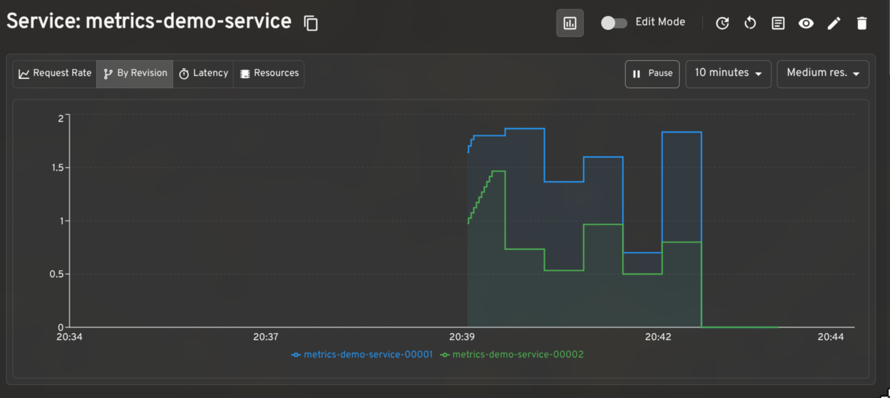
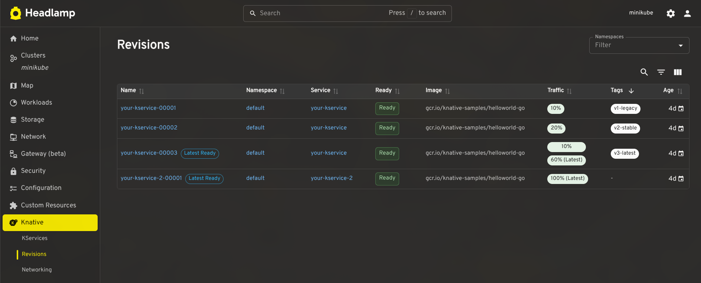
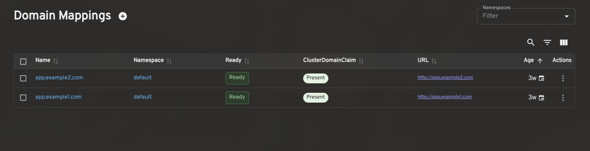
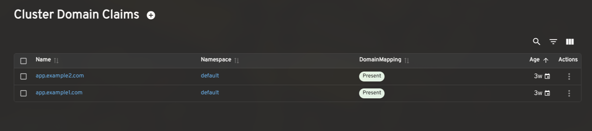

<!--
layout: blog
title: "See your serverless: introducing the Headlamp plugin for Knative"
date: 2026-06-25T10:00:00-08:00
slug: headlamp-knative-plugin
author: >
  [Mudit Maheshwari](https://github.com/mudit06mah) (independent),
  [Kahiro Okina](https://github.com/kahirokunn) (Craftsman Software, Inc.)
-->

<!--
[Headlamp](https://headlamp.dev/) is an open-source, extensible Kubernetes SIG UI project designed to let you explore, manage, and debug cluster resources.
-->
[Headlamp](https://headlamp.dev/) 是一个开源的、可扩展的 Kubernetes SIG UI 项目，
旨在让你探索、管理和调试集群资源。

<!--
[Knative](https://knative.dev/) brings serverless workloads to Kubernetes, handling traffic routing, autoscaling, and revision management so teams can deploy and iterate without fighting infrastructure. But operating Knative workloads day-to-day can be difficult, there's still a lot of jumping between the `kn` CLI, `kubectl`, and the Kubernetes UI to get a full picture of what's running.
-->
[Knative](https://knative.dev/) 将 serverless 工作负载引入 Kubernetes，
处理流量路由、自动扩缩容和版本管理，使团队能够在无需与基础设施打交道的情况下进行部署和迭代。
但是日常操作 Knative 工作负载可能很困难，仍然需要在 `kn` CLI、`kubectl` 和
Kubernetes UI 之间频繁切换才能全面了解运行状态。

<!--
We built the [Headlamp Knative plugin](https://github.com/headlamp-k8s/plugins/tree/main/knative) to bridge that very gap, allowing operators to inspect, understand and act on their workloads all from a single place. This plugin was built as part of the LFX mentorship. Here's a tour of what we shipped.

Here is a short walkthrough of the Knative plugin for Headlamp:


-->
我们构建了
[Headlamp Knative 插件](https://github.com/headlamp-k8s/plugins/tree/main/knative)来填补这一空白，
允许运维人员在单一位置检查、理解并对工作负载采取行动。
此插件是作为 LFX mentorship 的一部分构建的。以下是我们交付内容的导览。

以下是 Headlamp Knative 插件的简短导览：



<!--
## Integrating Knative resources with Headlamp's map view
-->
## 将 Knative 资源与 Headlamp 的 Map 视图集成

<!--
Headlamp's resource mapping works for Knative CRDs too. You can see how KServices, Revisions, and DomainMappings relate to each other in a single graph view.

-->
Headlamp 的资源映射同样适用于 Knative CRD。你可以在 Map 视图中查看
KService、Revision 和 DomainMapping 之间的关系。

<!--
## KService management: edit traffic splits, restart pods, and view logs
-->
## KService 管理：编辑流量分割、重启 Pod 和查看日志

<!--
A KService is the top-level resource in Knative: it manages the lifecycle of Routes, Configurations, Revisions, and everything needed to run and expose your application.

The plugin gives KServices a full detail view with an **Edit Mode** toggle for making live changes to traffic splits, autoscaling annotations, and more. Common actions like viewing the YAML, opening logs, triggering a redeploy, or restarting backing pods are surfaced in the header, gated by your current RBAC permissions.

-->
KService 是 Knative 中的顶级资源：它管理
Route、Configuration、Revision 的生命周期以及运行和暴露应用程序所需的一切。

该插件为 KServices 提供完整的详情视图，带有**编辑模式**切换开关，
可实时更改流量分割、自动扩缩容注解等。查看 YAML、打开日志、触发重新部署或重启后端
Pod 等常见操作显示在头部，受当前 RBAC 权限控制。

<!--
## Traffic splitting: route across revisions for gradual rollouts and testing
-->
## 流量分割：在版本之间路由以实现渐进式发布和测试

<!--
Knative makes it possible to route traffic across multiple Revisions of the same service. This is useful for canary releases, gradual rollouts, tagged preview URLs, and A/B testing.

The plugin shows the traffic assigned to each Revision, the latest ready Revision, readiness status, age, and configured tags. In edit mode, you can adjust percentages and tags inline. The plugin validates that traffic sums to 100% and that tags are unique before saving. Tagged routes with a reported URL render as clickable links.

-->
Knative 使得在同一服务的多个 Revision 之间路由流量成为可能。
这对于金丝雀发布、渐进式发布、标记预览 URL 和 A/B 测试非常有用。

该插件显示分配给每个 Revision 的流量、最新就绪的
Revision、就绪状态、运行时长和配置的标签。在编辑模式下，
你可以内联调整百分比和标签。插件在保存前验证流量总和为 100% 且标签唯一。
带有报告 URL 的标记路由会呈现为可点击的链接。

<!--
## Autoscaling configuration: view effective settings and cluster defaults
-->
## 自动扩缩容配置：查看有效设置和集群默认值

<!--
Knative's autoscaler supports a range of settings: concurrency targets, target utilization, RPS targets, min/max scale, initial scale, stable window, scale-down delay, and more. The effective value for any workload is a combination of KService-level annotations and cluster-wide ConfigMaps.

The plugin reads `config-autoscaler` and `config-defaults` and shows the effective configuration per KService in context, so you can see at a glance whether a setting is explicitly configured or falling back to the cluster default.

-->
Knative 的自动扩缩容器支持一系列设置：并发目标、目标利用率、RPS
目标、最小/最大扩缩容、初始扩缩容、稳定窗口、缩容延迟等。
任何工作负载的有效值是 KService 级别的注解和集群范围的 ConfigMap 的组合。

该插件读取 `config-autoscaler` 和 `config-defaults`，
并在上下文中显示每个 KService 的有效配置，因此你可以一目了然地看到某个设置是显式配置的还是回退到集群默认值。

<!--
## Prometheus metrics: monitor request rates, latency, and resource utilization
-->
## Prometheus 指标：监控请求速率、延迟和资源利用率

<!--
When paired with the [Prometheus plugin for Headlamp](https://github.com/headlamp-k8s/plugins/tree/main/plugins/prometheus), the plugin renders request rate, latency, and resource utilization graphs on KService and Revision detail pages. The per-revision request rate breakdown is particularly useful when validating a traffic split in progress.

-->
与 [Headlamp 的 Prometheus 插件](https://github.com/headlamp-k8s/plugins/tree/main/plugins/prometheus)配合使用时，
此插件在 KService 和 Revision 详情页面上呈现请求速率、延迟和资源利用率图表。
当验证进行中的流量分割时，每个 Revision 的请求速率细分特别有用。

<!--
## Dashboard for other CRDs
-->
## 其他 CRD 的仪表板

<!--
The plugin also includes list and detail views for Revisions, DomainMappings, ClusterDomainClaims, and a cluster-level Networking overview (reading `config-network` and `config-gateway` to surface the effective ingress class, gateway settings, and backing services). These give operators a complete picture of Knative's state without leaving Headlamp.

-->
该插件还包括 Revision、DomainMapping、ClusterDomainClaim 的列表和详情视图，
以及集群级别的网络概览（读取 `config-network` 和 `config-gateway` 以显示有效的
ingress class、网关设置和后端服务）。这些使运维人员无需离开 Headlamp 即可全面了解 Knative 的状态。

<!--
## How to install the Knative plugin in Headlamp
-->
## 如何在 Headlamp 中安装 Knative 插件

<!--
1. Make sure [Knative is installed](https://knative.dev/docs/install/) in your cluster.
2. In Headlamp Desktop, open the **Plugin Catalog**, search for Knative, and click Install.
3. Reload Headlamp, a new Knative entry will appear in the sidebar.

For development or source-level setup, see the [Knative plugin README](https://github.com/headlamp-k8s/plugins/tree/main/plugins/knative). The current release is [**0.3.0-beta**](https://github.com/headlamp-k8s/plugins/releases/tag/knative-0.3.0-beta).
-->
1. 确保集群中已安装 [Knative](https://knative.dev/docs/install/)。
2. 在 Headlamp Desktop 中，打开**插件目录库**，搜索 Knative，然后点击 Install。
3. 重新加载 Headlamp，侧边栏中将出现新的 Knative 入口。

有关开发或源代码级别的设置，请参阅
[Knative 插件 README](https://github.com/headlamp-k8s/plugins/tree/main/plugins/knative)。
当前版本是 [**0.3.0-beta**](https://github.com/headlamp-k8s/plugins/releases/tag/knative-0.3.0-beta)。

<!--
## Share your feedback
-->
## 分享你的反馈

<!--
We'd love feedback from Knative operators and users. If you hit a bug or want support for a workflow we haven't covered, [please open an issue](https://github.com/headlamp-k8s/plugins/issues). You can also find us in the [Kubernetes Slack #headlamp channel](https://kubernetes.slack.com/archives/headlamp).
-->
我们非常欢迎 Knative 运维人员和用户提供反馈。如果你遇到 Bug 或希望支持我们尚未涵盖的工作流，
请[打开 Issue](https://github.com/headlamp-k8s/plugins/issues)。
你也可以在 [Kubernetes Slack #headlamp 频道](https://kubernetes.slack.com/archives/headlamp)找到我们。
